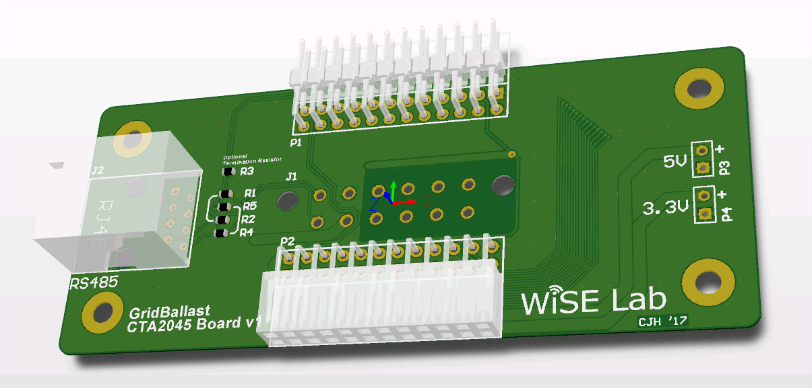

# GridBallast
Open Source Water Heater and Plug Load Controller

## Controller Board
This is the main board that interfaces with the peripherals.
The board integrate the following modules and features:
* ESP32
* U-Blox NEO-M8T GPS Timing Chip
* SX1276 Radio
* USB programming and debugging
* 2.4" OLED display
* 4 way navigation buttons
* Raspberry Pi connectivity
* 60Hz Frequency Monitor
* RS485 and I2C exposed interfaces
* 2000:1 current transformer input
* Amplified microphone input with phantom power
* Leak detector input


[Interactive 3D View](Hardware/Controller/Info/PCBv1.stl)

## Relay, CT, and Temp Board
This is the accessory board that has two onboard high-power relays, a current transformer, and two analog inputs for temperature sensors.


[Interactive 3D View](Hardware/Relay%20Board/RelayBoardV1.stl)

## CTA2045 and RS485 Board
This small accessory board holds the connector to support CTA2045 and other RS485 communications.


[Interactive 3D View](Hardware/CTA2045/Info/CTA2045v1.stl)

# Getting Started
1. Install the `xtensa-esp32-elf` toolchain by following the instructions here: http://esp-idf.readthedocs.io/en/latest/get-started/#setup-toolchain.
   Make sure the `xtensa-esp32-elf/bin` is added to your `PATH`.
1. Clone the repository
    ```
    $ git clone --recursive https://github.com/WiseLabCMU/gridballast.git
    ```
1. Setup the `IDF_PATH` environment variable by adding the following to your `~/.profile`:
    ```
    export IDF_PATH="<path/to/gridballast>/Support/esp-idf"
    ```
1. Build the controller module
    ```
    $ cd Source/framework
    $ make
    ```
    In the framework configuration, navigate to "Serial flasher config" and select the default serial port. This can be determined by checking which device appears in `/dev` when the controller module is connected via USB. It should start with `/dev/ttyUSB`.
    Save and exit the configuration interface.
1. Flash the controller
    ```
    $ make flash
    ```

# Runtime Configuration
The WiFi SSID and password can be configured at runtime (without recompiling and reflashing the module). Other parameters could be added as necessary.
Configuration parameters are stored in flash using the [NVS Library](http://esp-idf.readthedocs.io/en/latest/api-reference/storage/nvs_flash.html).
On initialization of the wifi module, if stored wifi configuration parameters exist, they are loaded and used to connect to wifi.
If no parameters exist, the module launches configuration mode.

In configuration mode, the module broadcasts a wifi network named "gridballast". A user can connect to the gridballast network and open
http://[module-ip]/ (by default 192.168.1.4, can be found programatically with `tcpip_adapter_get_ip_info`) in a web browser. The module will present a webpage where the SSID and password can be configured.
To exit configuration mode, the module must be rebooted.

TODO: Gridballast should also support entering configuration mode by pushing a button.
This can be done by calling `wifi_enter_config_mode()` (see `Source/framework/main/include/wifi_module.h`).
